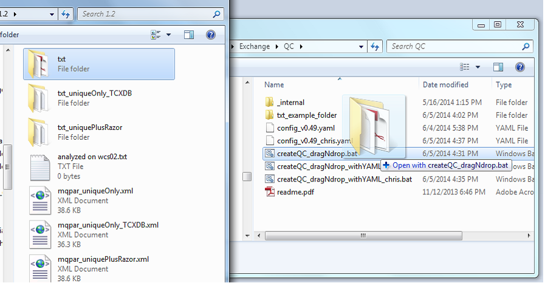

# Drag'n'drop Usage Guide for PTXQC

**Requirements:**

  - any Windows System 
  - R and PTXQC should be installed using the installation instructions
    at https://github.com/cbielow/PTXQC/tree/master/inst/dragNdrop.

## Generating a quick QC report without asking questions!

  - open a Windows Explorer and find your MaxQuant txt-output folder
  - open another Windows Explorer window and navigate to the (network) folder where the QC software
    was copied to during installation, e.g. `P:\Chris\Exchange\QC` (where drive P could be some network share).
  - drag'n'drop the txt folder onto `createQC_dragNdrop.bat` (you can also drag any file within the
    txt folder, e.g. `evidence.txt`)

 - A console will pop up and show stuff. Wait... if all went well, one of the last lines is `Time elapsed: ... min`
   and a pdf report within your txt folder. It has a version and a folder name attached to it
   (e.g. `report_v0.63_diabetes.pdf`). The version number will increase every time there is an 
   update in PTXQC (big change in version number means big change in functionality). 
   The name is taken from the path where the txt is located in - it helps you to distinguish
   report files when they are open in a PDF viewer or copied somewhere else. 
   The console window will stay up until you press a key.

## Generating a QC report using a configuration file

There are two ways to customize parameters for a report:

  - PTXQC will search for a YAML file within the txt-folder for which it generates the report. 
    If there is one (with the correct name, i.e. `report_vXXX.yaml`, where XXX is the PTXQC version number),
    this report file will be used. Thus, if you already have txt-folder containing a report pdf
    plus the `report_*.yaml` inside, just edit the YAML file and re-run 
    PTXQC.
  - If your txt-folder has not been analysed by PTXQC before *or* you want to try another configuration, 
    you can use the `createQC_dragNdrop_withYAML.bat`. This .bat file expects a YAML configuration file
    right next to itself. This YAML file you need to provide. But no worries. One such YAML file 
    with default parameters is generated each time you invoke a QC report generation. 
    Just take any YAML file from a previous run in any other txt-folder. Copy the YAML file next to the .bat file, and name it `config.yaml`.
    Modify it to your needs using a text editor such as Notepad.
    From now on, you can use the `createQC_dragNdrop_withYAML.bat` for any report which should use this configuration.
    The usage is identical to the one you already know - just target `createQC_dragNdrop_withYAML.bat` instead of `createQC_dragNdrop.bat`
    when dragging a txt-folder.

**Note**: The second option will take precedence over the first.

